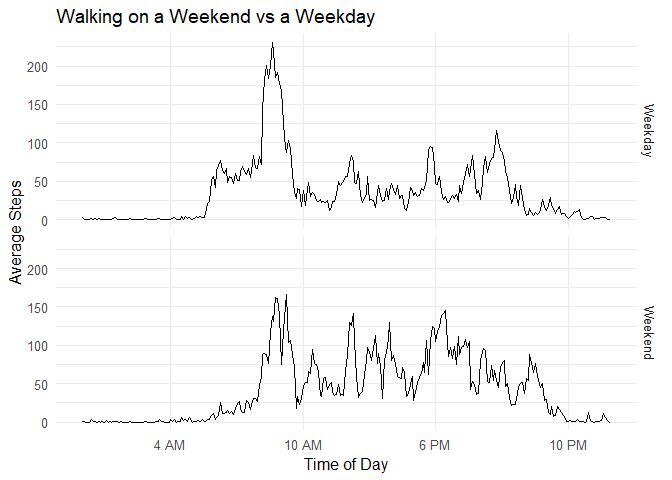

## Loading and preprocessing the data

As a first step, we load in the packages we will be using for this
assignment:


```r
suppressPackageStartupMessages(library(dplyr))
suppressPackageStartupMessages(library(ggplot2))
suppressPackageStartupMessages(library(xtable))
suppressPackageStartupMessages(library(stringr))
```
Now we load the data, located in the `activity.csv` file in this directory, and take a look at it.


```r
activity_data <- read.csv("activity.csv")
str(activity_data)
```

```
## 'data.frame':	17568 obs. of  3 variables:
##  $ steps   : int  NA NA NA NA NA NA NA NA NA NA ...
##  $ date    : Factor w/ 61 levels "2012-10-01","2012-10-02",..: 1 1 1 1 1 1 1 1 1 1 ...
##  $ interval: int  0 5 10 15 20 25 30 35 40 45 ...
```

We see that the dataframe contains a number of `NA` values for step
count at the top.
We want to remove these NA values from our analysis, but we will
take a look at how many data points we are removing when we do this.


```r
sum(is.na(activity_data$steps))
```

```
## [1] 2304
```

```r
sum(is.na(activity_data$date))
```

```
## [1] 0
```

```r
sum(is.na(activity_data$interval))
```

```
## [1] 0
```

```r
filtered_data <- filter(activity_data, !is.na(steps))
```
So, we see that the only variable with missing values is the `steps`
variable.
We have removed this variable for now, but will return to this consideration in section 4.

Finally, if we look at the `interval` variable, we see that the times are interpreted as integers, but actually represent hour:minute times:


```r
sample(filtered_data$interval, 10)
```

```
##  [1]  255 1315 1850  700  930   15  940 2315 1505 1745
```
We can fix this by converting the integers to a standard format, and then to a time (here we will use class `POSIXct`):


```r
filtered_data %>% 
  mutate(interval = str_pad(interval, 4, pad="0")) %>%
  mutate(interval = as.POSIXct(interval, format = "%H%M")) ->
  clean_data
sample(clean_data$interval, 10)
```

```
##  [1] "2019-02-23 00:55:00 EST" "2019-02-23 05:20:00 EST"
##  [3] "2019-02-23 17:40:00 EST" "2019-02-23 12:25:00 EST"
##  [5] "2019-02-23 12:20:00 EST" "2019-02-23 20:45:00 EST"
##  [7] "2019-02-23 17:45:00 EST" "2019-02-23 23:35:00 EST"
##  [9] "2019-02-23 04:40:00 EST" "2019-02-23 13:55:00 EST"
```
So the interval variable now contains the time (and a modern date, but we will not use this).
We're now ready to analyze the data!

## What is mean total number of steps taken per day?

To answer this question, we can first calculate the total number of
steps taken in a particular day, and find the mean and median of
this distribution.


```r
clean_data %>% group_by(date) %>% 
  summarise(total_steps = sum(steps)) -> total_data
mean <- mean(total_data$total_steps)
print(mean)
```

```
## [1] 10766.19
```

```r
median <- median(total_data$total_steps)
print(median)
```

```
## [1] 10765
```
So we see that the mean and median are almost equal at 10766 and 10765 respectively.
To get a better sense of the distribution, we can also plot a histogram of this data:


```r
ggplot(total_data, aes(x=total_steps)) +
  geom_histogram(bins=30, color='black', fill='deepskyblue3') +
  theme_bw(12) +
  xlab("Total Steps") +
  labs(title = "Histogram of Steps per Day") +
  geom_vline(xintercept = mean, color='tomato', 
             size=1, linetype=2)
```

<!-- -->
Here the dashed line shows the mean (and approximately the median) of the data.
The histogram shows that there is a spike at 10,000 steps per day, potentially indicating that this was the daily goal for the wearer of this device.
The 2 days at 0 steps are also potentially days when the device was not used at all.


## What is the average daily activity pattern?

Now we want to look at the activity over the course of a day, averaged across all days we have measurements for.

We take a similar approach here, fixing the interval instead of day, and computing an average:


```r
clean_data %>% group_by(interval) %>%
  summarise(avg_steps = mean(steps)) %>%
  ggplot(aes(x=(interval), y=avg_steps)) +
  geom_line() +
  xlab("Time interval") +
  ylab("Average Steps") +
  labs(title = "Average Steps Over a Day") +
  theme_bw(12) +
  scale_x_datetime(date_breaks = "6 hours", minor_breaks=NULL,
                   labels=c("","4 AM", "10 AM", "6 PM", "10 PM", ""))
```

<!-- -->

We see that the number of steps peaks in the morning some time before 10 AM. To find this exact time, we can sort our dataframe:


```r
clean_data %>% group_by(interval) %>% 
  summarise(avg_steps = mean(steps)) %>%
  arrange(desc(avg_steps)) %>% head(5) %>%
  mutate(interval = format(interval, format="%H:%M")) %>%
  xtable(align=c("c","c","c")) %>% print(type="html")
```

<!-- html table generated in R 3.5.2 by xtable 1.8-3 package -->
<!-- Sat Feb 23 00:27:28 2019 -->
<table border=1>
<tr> <th>  </th> <th> interval </th> <th> avg_steps </th>  </tr>
  <tr> <td align="center"> 1 </td> <td align="center"> 08:35 </td> <td align="center"> 206.17 </td> </tr>
  <tr> <td align="center"> 2 </td> <td align="center"> 08:40 </td> <td align="center"> 195.92 </td> </tr>
  <tr> <td align="center"> 3 </td> <td align="center"> 08:50 </td> <td align="center"> 183.40 </td> </tr>
  <tr> <td align="center"> 4 </td> <td align="center"> 08:45 </td> <td align="center"> 179.57 </td> </tr>
  <tr> <td align="center"> 5 </td> <td align="center"> 08:30 </td> <td align="center"> 177.30 </td> </tr>
   </table>
We see that the 8:35 AM interval has the highest average steps (a morning walk before work, perhaps).


## Imputing missing values

We computed the number of missing values in the first section, but we will reproduce it here:


```r
sum(is.na(activity_data$steps))
```

```
## [1] 2304
```
There are 2304 missing values in this dataset.
We can replace the missing values by their average over the interval
they appear in:


```r
activity_data %>% group_by(interval) %>%
  mutate(avg_steps = mean(steps, na.rm=TRUE)) %>%
  mutate(steps = ifelse(is.na(steps),yes=avg_steps,no=steps)) ->
  imputed_data

sum(is.na(imputed_data$steps))
```

```
## [1] 0
```
Now let's take another look at this data through the mean and median:


```r
imputed_data %>% group_by(date) %>%
  summarise(total_steps = sum(steps)) ->
  imputed_totals
imputed_mean <- mean(imputed_totals$total_steps)
print(imputed_mean)
```

```
## [1] 10766.19
```

```r
imputed_median <- median(imputed_totals$total_steps)
print(imputed_median)
```

```
## [1] 10766.19
```
Now both the mean and median are both the same at 10766. Let's see how the histogram looks:


```r
ggplot(imputed_totals, aes(x=total_steps)) +
  geom_histogram(bins=30, color='black', fill='deepskyblue3') +
  theme_bw(12) +
  xlab("Total Steps") +
  labs(title = "Histogram of Steps per Day (Imputed)") +
  geom_vline(xintercept = imputed_mean, color = 'tomato',
             size = 1, linetype=2)
```

<!-- -->
We see that the imputed data has led to a change right around 10,000 steps, so that some of the days in the 10,000 step bin are now in the next bin.

This might suggest that the missing values were not counted for the user either, who may have been aiming for a 10,000 step goal.
Either we are overcounting some steps that were not taken, or the user took extra steps to register 10,000 steps despite taking more than that throughout the day.

So, while the mean is unchanged and the median barely changed, the distribution is slightly different due to this 10,000 step threshold behavior (note that no other bins changed significantly)


## Are there differences in activity patterns between weekdays and weekends?

We next look at the activity differences between weekdays and weekends, which we can accomplish by breaking down our date variable into a factor of "Weekday" and "Weekend".


```r
imputed_data %>% mutate(day_of_week = weekdays(as.Date(date))) %>%
  mutate(day_type = ifelse(day_of_week == "Saturday" | 
                             day_of_week == "Sunday", 
                           yes="Weekend", no = "Weekday")) %>%
  mutate(day_type = as.factor(day_type)) -> week_data
```
Now we can analyze this data by doing the same kind of interval analysis we did before.
We again have to format our interval times:


```r
week_data %>% ungroup %>%
  mutate(interval = str_pad(interval, 4, pad="0")) %>%
  mutate(interval = as.POSIXct(interval, format = "%H%M")) %>%
  group_by(day_type, interval) %>%
  summarise(avg_steps = mean(steps)) %>%
  ggplot(aes(x=interval, y=avg_steps)) +
  geom_line() +
  scale_x_datetime(date_breaks = "6 hours", minor_breaks=NULL,
                   labels=c("","4 AM", "10 AM", "6 PM", "10 PM",""))+
  theme_minimal(12) +
  xlab("Time of Day") +
  ylab("Average Steps") +
  facet_grid(day_type~.) +
  labs(title = "Walking on a Weekend vs a Weekday")
```

<!-- -->

The plots show that weekend walking is generally more spread out than weekday walking, which is sharply peaked before 9AM (work hours).
On the weekends, walking in the afternoon and early evening were more likely, and the distribution was flatter overall.

